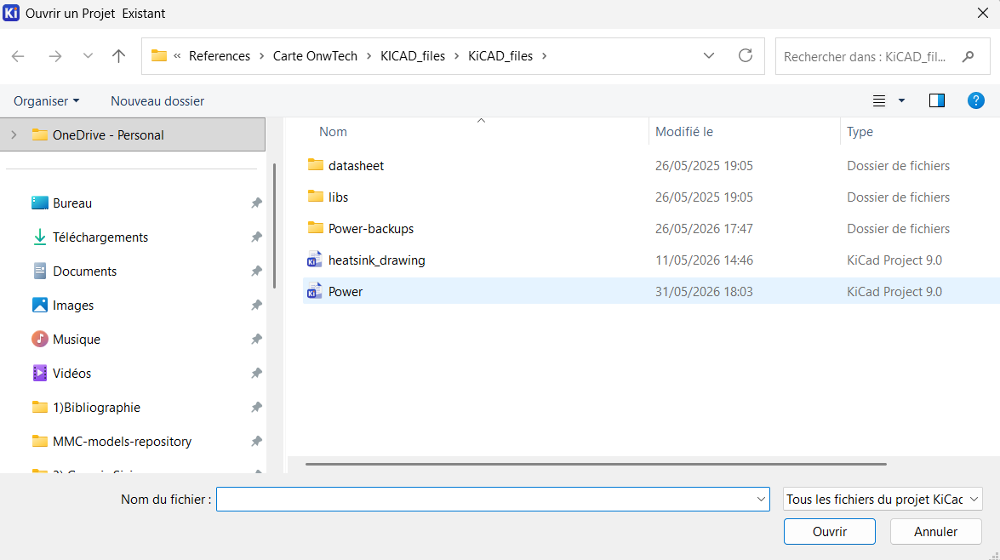
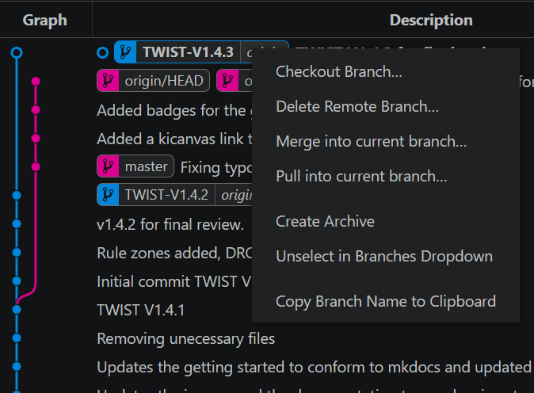
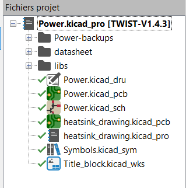

# Owntech's board KICAD access

This tutorial aims to teach how to access the KICAD schematics of TWIST/Ownverter boards for those who are not habituated with github usage.

## VScode initial setup

If not done yet, follow the tutorial [VScode for OwnTech tutorial](Vscode_for_OwnTech_configuration.md) to configure your VScode to program OwnTech's boards.

You now must have access to Git Graph tool in VScode that is necessary to follow this tutorial.

## Install KICAD

To install KICAD in your PC, go to https://www.kicad.org/download/ and follow its instructions.

## Cloning board schematics for TWIST

1) Go to https://github.com/owntech-foundation/TWIST/tree/TWIST-V1.4.X

2) In the , copy the https URL.

3) In Vscode, open a folder where you would to copy the KICAD files.

4) Open a Git Bash terminal and use the command "git init" to open a empty Git repository.

5) Clone the KICAD files to this repository using the following commands in the Git Bash terminal:
    - git remote add -f origin <url>
    - git config core.sparseCheckout true
    - echo "KiCAD_files" >> .git/info/sparse-checkout
    - git pull origin TWIST-V1.4.X

6) Open KICAD. Open the schematics by using "Open project" button in the "Files" tab in KICAD. Select the "Power" file. You now have access to the KICAD files of the TWIST board.

7) Now you must have a list of different files to see in KICAD. The two most important files are:
    - Power.kicad_sch: It is the main schematic file. Here you can see how the electrical/electronic connections of the board are done and the different devices used to build it.
    - Power.kicad_pcb: It is the pcb file. Here you can see the correspondence of the physical implementation with the electronic circuits of the main schematic file.

Comment: We could use simply git clone but it would clone all TWIST repository folders, so we clone only the KICAD folder to reduce memory waste.

## Cloning board schematics for Ownverter

Do the same steps done to obtain TWIST schematics.

## Changing between schematics of boards different versions

Sometimes, it is necessary to work with boards of different versions and it is important to reckon the physical differences between versions using KICAD. To change the current version seen in KICAD:

1) In VScode, open the folder with the KICAD schematics.

2) Use Git Graph to select the branch version you want to change to. Click with your right mouse button over it. Checkout to this branch.

3) Open the project again with KICAD. Verify in KICAD if the selected version is the one you desire in the upper-left side project title. In this example I have chose the 1.4.3 version of TWIST board.

