# MMC phase test in open-loop (First done in 3rd CARROTS Hackathon - Grenoble)

## Objectives and context

The objective of this task is to build a MMC phase considering that we already have two MMC stacks of 5 modules.

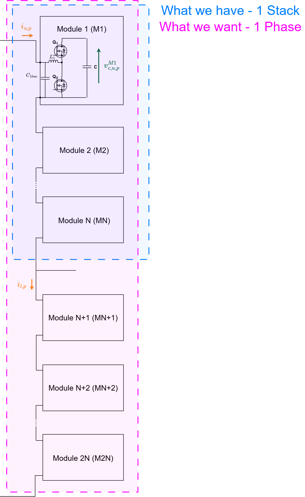

## Required Hardware list
- 11 TWIST boards with SPIN (extra 5 if necessary?)
- 2 DC power supplies of 6 V with minimum 2 A
- 2 DC power supply of (48 V, 5 A)
- 2 Protection diodes (at least 100 V)
- 2 DC bus capacitors around 4500 µF
- 2 stack inductances around 5 mH
- 1 variable resistor
- 10 ethernet cables
- PC 64-bits (windows or linux)
- Oscilloscope (PicoScope used as default)
- Current probes (10 A peak-to-peak, 10 kHz)
- Differential probes for voltage measurements

## Required Software list
- Git
- Visual Studio Code with PlatformIO (follow [VScode for OwnTech tutorial](Vscode_for_OwnTech_configuration.md).)

## Get base code from VScode

First, we need to load the base code from the stack test with CVB in the OwnTech example repository version in https://github.com/analuhaas/examples 
1.	In VScode, open the folder where you previously cloned OwnTech’s github.
2.	In platformio.ini file, substitute the owntech_examples variable link by https://github.com/analuhaas/examples.git 
3.	Go to platform.io icon , go to Examples Twist under the Project Tasks tab and click on “MMC arm – with CVB” or “MMC phase”.

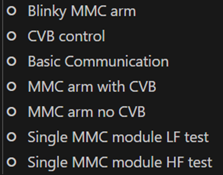

4.	Now you have the good code to start in your VScode.

## Preliminary Task 1: If not done yet, go up to stack Hardware setup
### Subtask 1.1 - Modify TWIST boards and verify their measurement calibration

It is necessary to modify the TWIST boards used as modules if not done yet. To do it, follow the [TWIST modifications for MMC tutorial](twist_modifications_MMC_tutorial.md).

Also, you need to calibrate the board sensors using the [calibration tutorial](twist_calibration_tutorial.md).

### Subtask 1.2 - Test all modules using both low-frequency and high-frequency test sequences
#### Objective: Verify if all modules are working individually.

To test the modules, use the module [low-frequency test tutorial](module_LF_test_tutorial.md) and [high-frequency test tutorial](module_HF_test_tutorial.md).

### Subtask 1.3 - Build and test stacks
#### Objective: Verify if stacks are working individually.

Repeat for the upper and lower stacks the [stack test tutorial](stack_openloop_CVB_test_tutorial.md). Be sure to verify if the current and voltage measurements of the modules are calibrated.

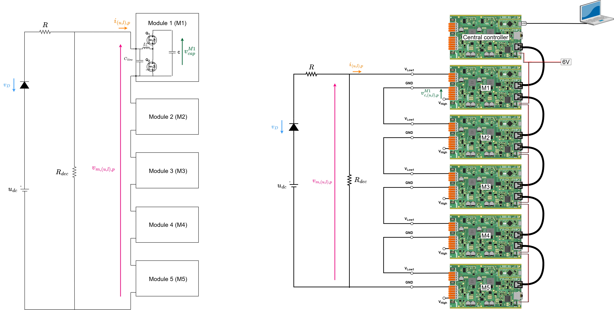

## Task 2: Phase test using phase circuit#1 (no current)

#### Task objective: Verify if stack voltages are well generated, having stepped waveform, and well synchronized, having 180° phase-shift.

The theorical and experimental implementation electrical circuits for circuit #1 are described in the figure below. The steps to achieve this configuration are:

5.	Connect the upper and lower stacks in series using VLOW1 and GND terminals to form an MMC phase using banana cables (figure below).
6.	Connect each module of the phase to the External Auxiliary DC Power Supply via the 6 V and DGND white PINs (figure below). Use one External Auxiliary DC Power Supply for each stack or connect the stacks 6 V in parallel. Make sure that the External Auxiliary DC Power Supplies are configured to deliver 6 V with limiting current of 2 A. Make sure the power supply OUTPUT IS OFF.
7. Add extra 1.1 mF capacitance in parallel to Vhigh and DGND terminals to increase module capacitor ($𝐶= C_{extra} + 𝐶_{𝐻𝑖𝑔ℎ} \approx 1300 \mu 𝐹$).
8.	Connect the controller board and all modules by ethernet cables as in the image (figure below).
9.	Connect the stack to the 2 DC power supplies using the 2 protection diodes.

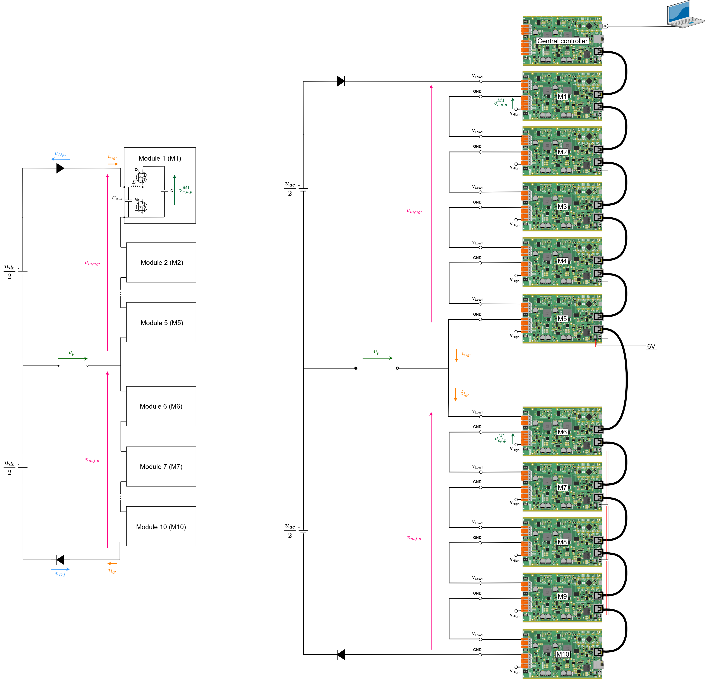

10. Configure the 2 DC power supplies to 24 V (sum up 48 V in the DC bus).
11.	Connect the voltage and current measurements with the oscilloscope. Recommended measures:
    - Upper arm voltage
    - Lower arm voltage
    - Phase voltage
    - Upper arm current
    - Lower arm current
    - 1 Capacitor voltage
12.	Configure your Oscilloscope (PicoScope or other).
13.	Test the phase using the example code.
    - Get the correct test code using “MMC phase”  button.
    - Repeat to all 5 module boards M1, M2, M3, M4, M5:
      * Connect the board to the PC via a USB-C cable.
      * If the module needs specific calibration value, insert this code snippet on setup_routine() after the "" line. Change the module ID according to its function on the phase.

        ``` ruby
        if(module_ID == MMC_SM4)
            {
                shield.sensors.setConversionParametersLinear(V_HIGH,0.0297809746442154,0.0816717736324648);
                shield.sensors.setConversionParametersLinear(V1_LOW,0.0447118735275233,-85.4652963581883);
                shield.sensors.setConversionParametersLinear(V2_LOW,0.044724349440928,-85.9790466977148);
                shield.sensors.setConversionParametersLinear(I1_LOW,0.00572228696154378,-12.9647582710024);
                shield.sensors.setConversionParametersLinear(I2_LOW,0.00573807392353278,-12.98795596087);
                shield.sensors.setConversionParametersLinear(I_HIGH,0.00505978197917605,-9.74527087864709);

            }
        ```
      
      * Build  and Upload  the code main.cpp into the board.
      * Open the serial monitor and copy the board ID to the identification list in the code according to its function in the stack
        ``` ruby
        /* -------------- BOARD IDENTIFICATION ----------------------- */
        /* --------------- To be changed by user --------------------- */

        constexpr uint32_t UID_MMC_LEAD_BOARD = 0x002B002A;
        constexpr uint32_t UID_MMC_SM1_BOARD = 0x0033004C;
        constexpr uint32_t UID_MMC_SM2_BOARD = 0x0031001B;
        constexpr uint32_t UID_MMC_SM3_BOARD = 0x00330049;
        constexpr uint32_t UID_MMC_SM4_BOARD = 0x0033004B;
        constexpr uint32_t UID_MMC_SM5_BOARD = 0x00330054;
        constexpr uint32_t UID_MMC_SM6_BOARD = 0x0032003F;
        constexpr uint32_t UID_MMC_SM7_BOARD = 0x004E0048;
        constexpr uint32_t UID_MMC_SM8_BOARD = 0x00470026;
        constexpr uint32_t UID_MMC_SM9_BOARD = 0x004C001D;
        constexpr uint32_t UID_MMC_SM10_BOARD = 0x0047002B;
        ```

      * Do again: Build  and Upload  the code main.cpp into the board.
    - Build  and Upload  the code main.cpp into the Central Controller board.
    - Let the USB-C cable connected to the Central Controller board during the test.
    - Make sure the External Auxiliary DC Power Supplies are configured to deliver 6 V with limiting current at max 2 A. TURN ON the External Auxiliary DC Power Supplies output.
    - After the capacitor voltages comes back to 0, TURN ON the main power supply $u_{dc}$.
    - After the modules are charged with stable voltages more and less at the same level, click “p” to start phase operation with NLM (with CVB).
    - Tap "a" and then "r" to record the scope monitored measurements.
    - Acquire your oscilloscope results.
    - TURN OFF the main power supply $u_{dc}$.
    - Click “i” to stop phase operation and put all modules in IDLE mode (blocked state).
    - TURN OFF all 6V External Auxiliary DC Power Supplies.

#### Results

By performing simulation with [phase circuit#1 simulink](https://github.com/analuhaas/MMC/tree/tutorials_updates/MMC_models/Phase/TWIST_based/circuit1) we obtain the following simulation results:
- There is only current for charging capacitors. Less than 1 A on the stack ($𝑖_{𝑢,𝑝}$ and $𝑖_{𝑙,𝑝}$)
- Open circuit = No AC phase current

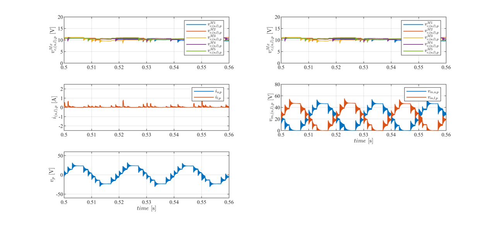

Similar results are obtained for experimental results:

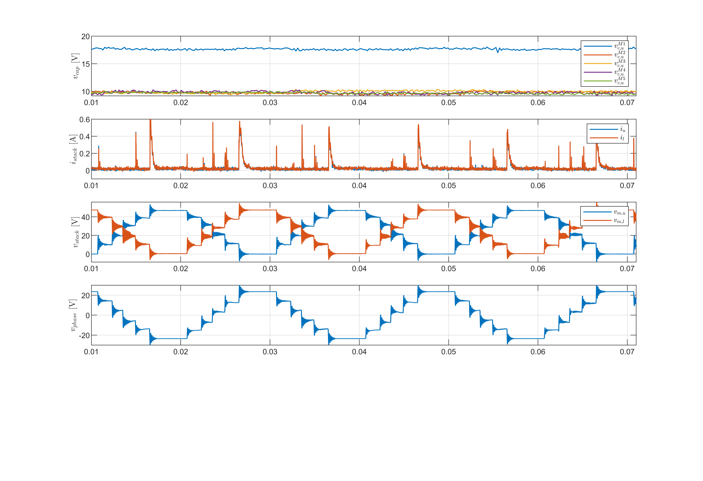

## Task 3: Phase test using phase circuit#2 (AC current)
#### Task objective: Verify if a AC current proportional to AC voltage is generated.

The theorical and experimental implementation electrical circuits for circuit #2 are described in the figure below. The steps to achieve this configuration from circuit #1 are:

14. Connect a variable resistor between the phase and DC Power Supplies middle points. We recommend to set it to a $𝑅=15 \Omega$ value.

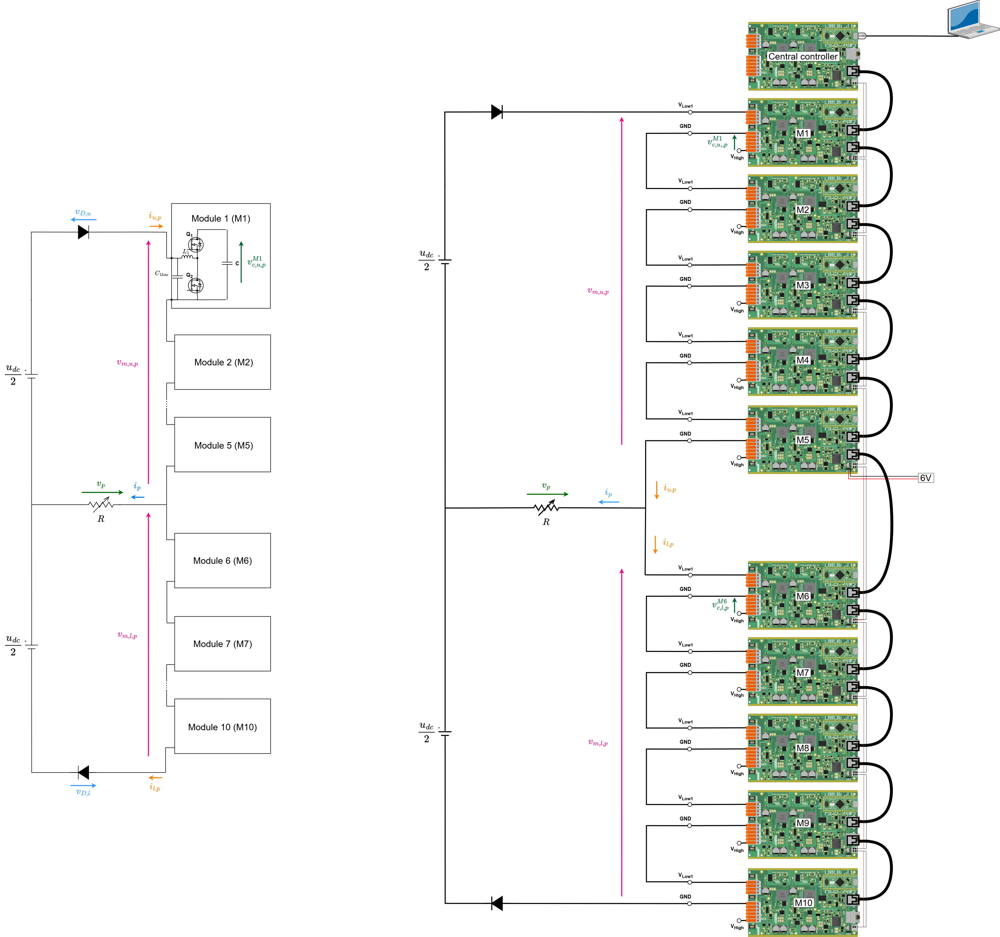

15.	Connect the voltage and current measurements with the oscilloscope. Recommended measures:
    - Upper arm voltage
    - Lower arm voltage
    - Phase voltage
    - Phase current
    - Upper arm current
    - Lower arm current
    - 1 Capacitor voltage
16.	Configure your Oscilloscope (PicoScope or other).
17.	Test the phase using the example code.
    - Use the same code as done for circuit #1.
    - Connect the USB-C cable to the Central Controller board.
    - Make sure the External Auxiliary DC Power Supplies are configured to deliver 6 V with limiting current at max 2 A. TURN ON the External Auxiliary DC Power Supplies output.
    - After the capacitor voltages comes back to 0, TURN ON the main power supply $u_{dc}$.
    - After the modules are charged with stable voltages more and less at the same level, click “p” to start phase operation with NLM (with CVB).
    - Acquire your oscilloscope results.
    - TURN OFF the main power supply $u_{dc}$.
    - Click “i” to stop phase operation and put all modules in IDLE mode (blocked state).
    - TURN OFF all 6V External Auxiliary DC Power Supplies.

#### Results

By performing simulation with [phase circuit#2 simulink](https://github.com/analuhaas/MMC/tree/tutorials_updates/MMC_models/Phase/TWIST_based/circuit2) we obtain the following simulation results:
- AC phase current present but not sinusoidal
- AC phase current has same format as AC voltage (resistance load)
- Only positive currents on the stacks due to protection diodes

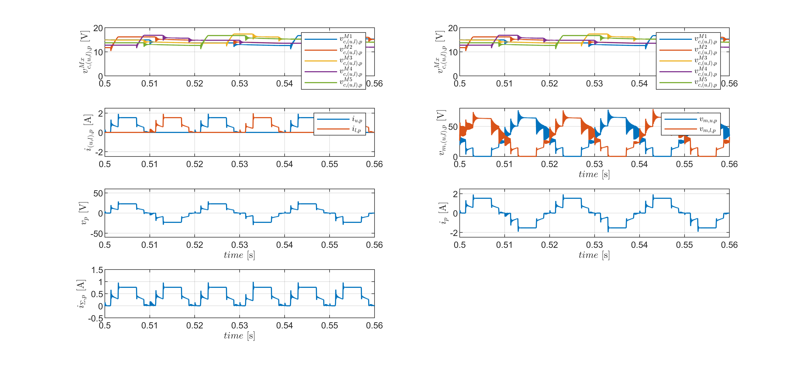

Similar results are obtained for experimental results:

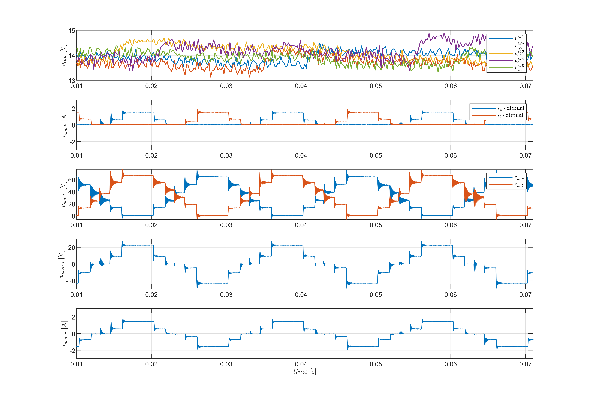

## Task 4: Phase test using phase circuit#3  (Negative stack currents)
#### Task objective: Verify if the stack currents achieves negative values.

The theorical and experimental implementation electrical circuits for circuit #3 are described in the figure below. The steps to achieve this configuration from circuit #2 are:

18. Substitute the 2 DC power supplies and diodes by 1 single DC power supply with 1 protection diode as shown in the figure. Configure the DC power supply to 48 V.
19. Connect 2 DC bus capacitors in parallel to the DC power supply and the phase as shown in the figure (used $𝐶_{𝑏𝑢𝑠}=4400 \mu 𝐹$).
20. Connect the DC bus capacitors middle point with the load resistance as shown in the figure.

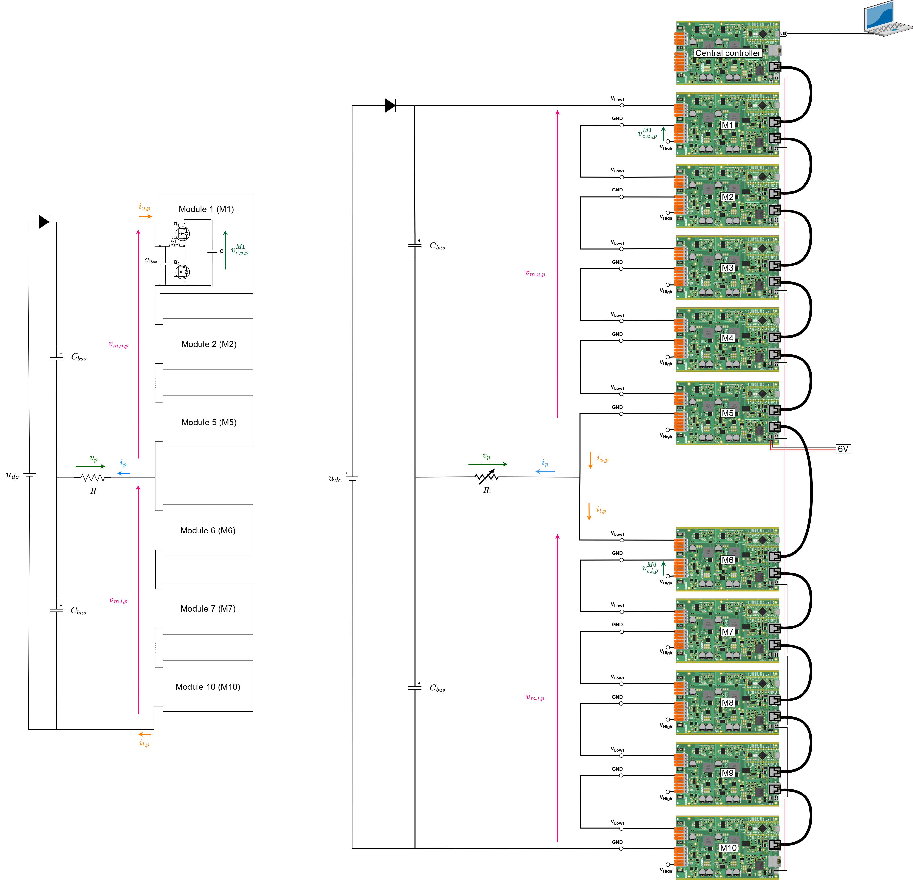

21.	Use same Measurements and Oscilloscope (PicoScope or other) configuration as for circuit #2.
22.	Test the phase using the example code.
    - Use the same code as done for circuit #1 and #2.
    - Connect the USB-C cable to the Central Controller board.
    - Make sure the External Auxiliary DC Power Supplies are configured to deliver 6 V with limiting current at max 2 A. TURN ON the External Auxiliary DC Power Supplies output.
    - After the capacitor voltages comes back to 0, TURN ON the main power supply $u_{dc}$.
    - After the modules are charged with stable voltages more and less at the same level, click “p” to start phase operation with NLM (with CVB).
    - Acquire your oscilloscope results.
    - TURN OFF the main power supply $u_{dc}$.
    - Click “i” to stop phase operation and put all modules in IDLE mode (blocked state).
    - TURN OFF all 6V External Auxiliary DC Power Supplies.

#### Results

By performing simulation with [phase circuit#3 simulink](https://github.com/analuhaas/MMC/tree/tutorials_updates/MMC_models/Phase/TWIST_based/circuit3) we obtain the following simulation results:
- Negative currents but too much oscillations, probably due to fast current demand (small C) and switching harmonics
- Harmonics also present on $i_Sigma$ current
- Improved voltage and current outputs
  
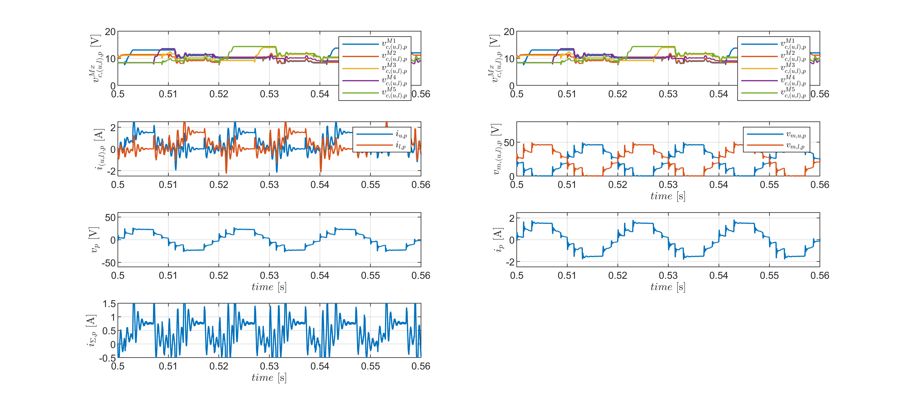

We simulated incrementing the module capacitance from $𝐶=𝐶_{𝐻𝑖𝑔ℎ}=188,4 \mu 𝐹$ to $𝐶=1308,4 \mu 𝐹$ and obtained these results:
- Increasing C reduced oscillations but  stack current still have switching harmonics
- Switching Harmonics still present on $i_Sigma$ current but reduced
  
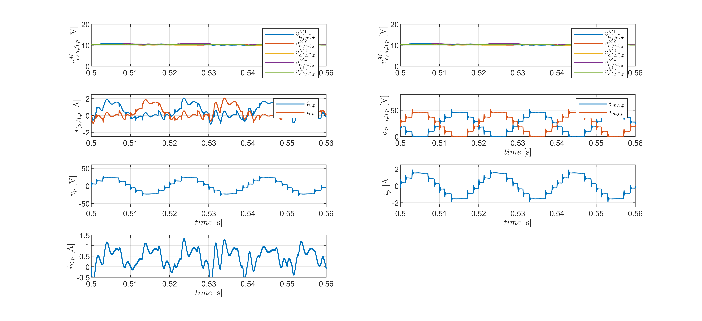

Similar results are obtained for experimental results:

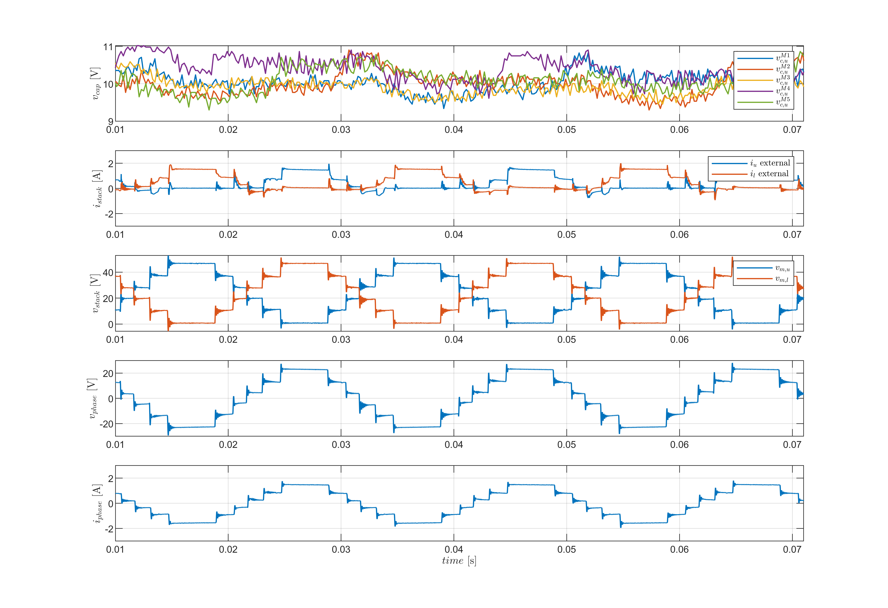

## Task 5: Phase test using phase circuit#4 (Filtered AC current)
#### Task objective: Verify if the stack currents are sinusoidal and if a AC sinusoidal current is generated.

The theorical and experimental implementation electrical circuits for circuit #4 are described in the figure below. The steps to achieve this configuration from circuit #3 are:

23. Add 2 arm inductors in series with the upper and lower arms as shown in the figure (used $L = 30 mH$).

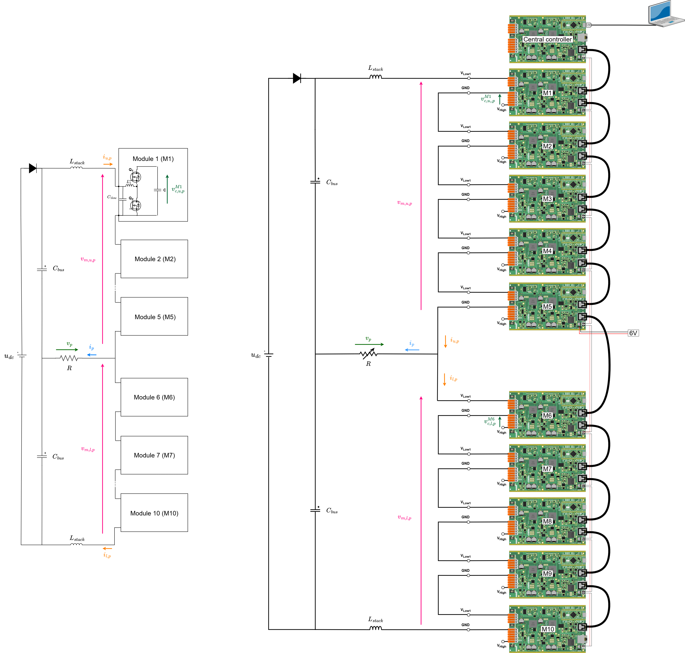

24.	Use same Measurements and Oscilloscope (PicoScope or other) configuration as for circuit #2.
25.	Test the phase using the example code.
    - Use the same code as done for circuit #1 and #2.
    - Connect the USB-C cable to the Central Controller board.
    - Make sure the External Auxiliary DC Power Supplies are configured to deliver 6 V with limiting current at max 2 A. TURN ON the External Auxiliary DC Power Supplies output.
    - After the capacitor voltages comes back to 0, TURN ON the main power supply $u_{dc}$.
    - After the modules are charged with stable voltages more and less at the same level, click “p” to start phase operation with NLM (with CVB).
    - Acquire your oscilloscope results.
    - TURN OFF the main power supply $u_{dc}$.
    - Click “i” to stop phase operation and put all modules in IDLE mode (blocked state).
    - TURN OFF all 6V External Auxiliary DC Power Supplies.

#### Results

By performing simulation with [phase circuit#4 simulink](https://github.com/analuhaas/MMC/tree/tutorials_updates/MMC_models/Phase/TWIST_based/circuit4) we obtain the following simulation results:
- Smooth stack current but deformed voltage because capacitors are too small makes charge/discharge fast
- Phase voltage and current almost sinusoidal
- 2 omega Harmonics present on $i_Sigma$ current
  
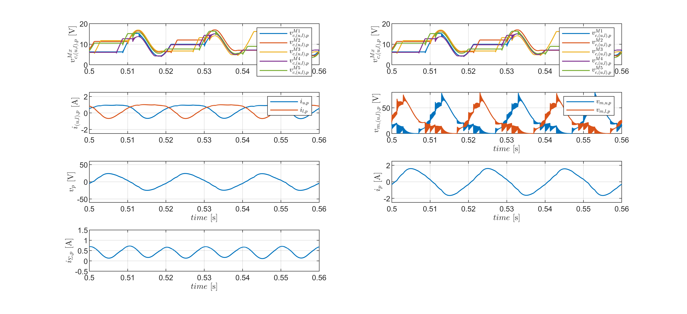

We tried to increment the module capacitance from $𝐶=𝐶_{𝐻𝑖𝑔ℎ}=188,4 \mu 𝐹$ to $𝐶=1868,4 \mu 𝐹$ and obtained these results:
- Smooth current and stepped voltage on stack due to slower capacitor charge/discharge
- Phase voltage and current sinusoidal
- Almost null 2 omega Harmonics on $i_Sigma$ current
  
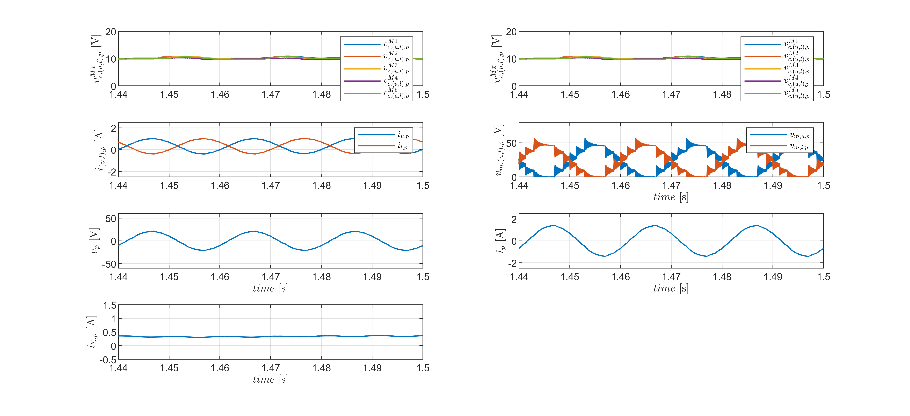

Similar results are obtained for experimental results:

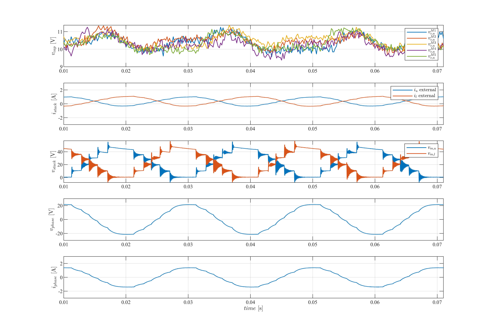
  


