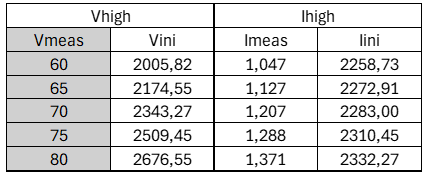
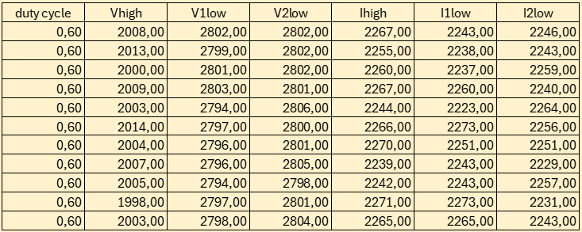
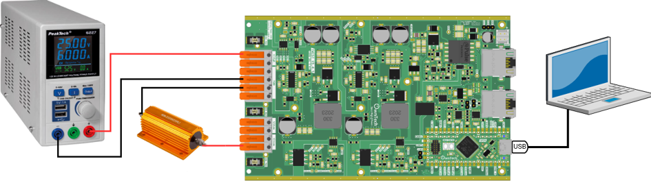
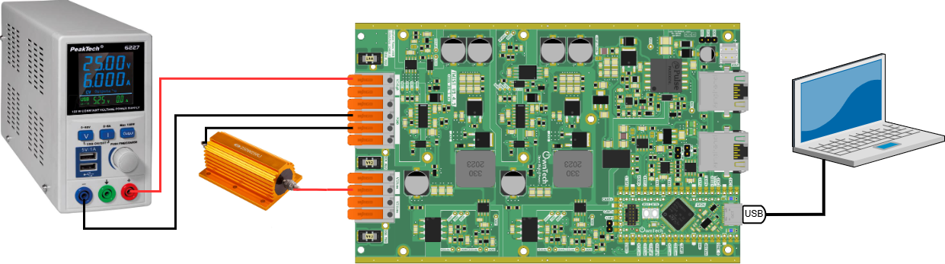
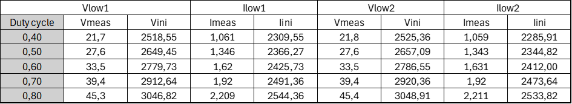

# Boards Sensors Calibration Tutorial

## Required hardware

- TWIST v_1_3
- 64-bit PC (Windows or Linux)
- DC Power Supply (48 V, 2 A)
- Resistive Load
- Oscilloscope or Multimeter

## Required Software

- Git
- Visual Studio Code with PlatformIO

## Objective

Before moving on to any closed-loop control, it is necessary to calibrate the board’s sensors.
This tutorial uses the code for Buck in Voltage Mode.

## What is sensor calibration?

Calibrating a sensor means adjusting or correcting the sensor's readings so they accurately reflect the physical quantity being measured.This typically involves comparing the sensor’s outputs with known reference values, and applying correction factors (gain and offset) to minimize measurement errors.

The correction formula is:

$V_{real}  = V_{init} \cdot gain + offset$

These corresponds to :
- $V_{real}$: Actual voltage/current value of the converter
- $V_{init}$: Raw measured value from the board sensor
- gain and offset: Correction factors we want to determine to obtain accurate measurements.

The TWIST board has 6 sensors in its structure as shown in the figure below. The following variables associated to the sensors will be calibrated:
- V_HIGH - High-side voltage
- V1_LOW - Low-side voltage 1
- V2_LOW - Low-side voltage 2
- I_HIGH - High-side current
- I1_LOW - Low-side current 1
- I2_LOW - Low-side current 2

Start by initializing all parameters with a gain of 1 and an offset of 0 by including the following code on the setup_rotine() function.
This allows us to observe the raw values (V_init) as-is in the serial monitor (V_init  * 1 + 0 = V_init).

'''
data.setParameters(V_HIGH, 1,0);
data.setParameters(V1_LOW, 1,0);
data.setParameters(V2_LOW, 1,0);
data.setParameters(I1_LOW, 1,0);
data.setParameters(I2_LOW, 1,0);
data.setParameters(I_HIGH, 1,0);
'''

## Calibrating the high-side sensors
To calibrate the high-side voltage and current sensors, connect your TWIST board to the power supply and the PC via USB-C and do the wiring as follows:
- Connect the TWIST’s V_high and GND pins to the DC power supply (limit the supply current to 1 A).
- Connect VLow1, VLow2, and GND to a resistive load.
- Connect the USB-C port of the SPIN board to your PC.
- Set the power supply voltage between 0 and 48 V.

The variables V_HIGH and I_HIGH correspond to the input voltage and current of the converter.

The variables V_LOW and I_LOW correspond to the output voltage and current of the converter.

Using a voltmeter (for V_HIGH) or an ammeter (for I_HIGH), we measure the values on the external DC supply output.

To calibrate V_HIGH and I_HIGH, we must vary the input power supply voltage to observe how the sensor measurements of V_HIGH and I_HIGH (Vini, Iini) changes in Vscode before calibration.

Then, we compare the measured values of V_HIGH and I_HIGH by the external voltmeter and ammeter (Vmeas, Imeas) with those reported by the board sensor.

An example of spreadsheet for the calibration of V_HIGH and I_HIGH sensors is:

We determine the gain and offset for each sensor using the spreadsheet to plot a linear regression in the format shown here form for the voltage:

$V_{meas}  = A V_{init}  + B$

Where:
- Vmeas is on the Y-axis (measured with external equipment)
- Vinit is on the X-axis (raw sensor value from the board)
- A is the gain, and B is the offset

The same is done for the current:

$I_{meas}  = C I_{init}  + D$

Where:
- Imeas is on the Y-axis (measured with external equipment)
- Iinit is on the X-axis (raw sensor value from the board)
- C is the gain, and D is the offset

The gain and the offset calculations are done using the following functions on EXCEL:

- In French:
=PENTE(Vmeas;Vini)
=ORDONNEE.ORIGINE(Vmeas;Vini)

- In English :
=SLOPE(Vmeas;Vini)
=INTERCEPT(Vmeas;Vini)

We obtain the following curve with a gain of 0,029826144 and an offset of 0,149339404 for V_high and a gain of 0,004255763 and an offset of -8,543964735 for I_high.

Finally, we can apply the correction in Vscode for Vhigh and Ihigh using the gain and offset obtained from the curve using the code lines:

'''
data.setParameters(V_HIGH, 0.029826144, 0.149339404);
data.setParameters(I_HIGH, 0.004255763, -8,543964735);
'''

### Attention: measurements variation

⚠  Multiple measurements are printed in the serial monitor terminal. Since these measurements changes a lot, it’s recommended to use the mean value to determine Vini and Iini.

Example:

In this table, it is shown the 10 last measurements printed on the serial monitor for the test where Vmeas = 60 V for V_HIGH.

For the calibration, Vini and Ini where calculated as the mean of these last 10 sensor measured Vhigh and Ihigh,  having Vini = 2005,82 V and Iini = 2258,73 A.

### Attention: Sensors error

⚠ The measured currents for Ihigh, Ilow1 and Ilow2 should be higher than 1A and lower than the maximum current 8 A for calibration.

The current sensors presents higher measurement error with currents lower than 1 A, as shown in the TWIST datasheet.

More information about the sensors are provided in https://docs.owntech.org/1.0.0/twist/1.4.1/getting_started/#measurement-chains 

## Calibrating the low-side sensors

To perform calibrations for the low-side sensors, you need to change the hardware wirings in two times :

- For calibrating V_Low1 and I_Low1: Put the resistance between Low1 and GND pins

- For calibrating V_Low2 and I_Low2: Put the resistance between Low2 and GND pins

Excluding the modifications on hardware setup, the calibration is performed in the same way for both Low1 and Low2 sensors.

Using a external voltmeter for V_LOW or an external ammeter for I_LOW, we can measure its values at the resistive load output (Vmeas, Imeas).

1) Using the hardware setup for calibrating Low1 sensors:
- With a fixed voltage on the DC power supply, we vary the duty cycle of the converter (using the u and d keys) to generate changes in the output voltage/current.
- Using an external voltmeter for V_LOW1 and an external ammeter for I_LOW1, we measure its values at the resistive load output (Vmeas, Imeas).
- Then, we compare the measured V_LOW1 and I_LOW1 by the external voltmeter with the raw sensor values from the board (Vini, Iini) printed in Vscode serial monitor before calibration. We note these values on the spreadsheet in order to calibrate sensors V_LOW1 and I_LOW1.

2) Using the hardware steup for calibrating Low2 sensors:
- With a fixed voltage on the DC power supply, we vary the duty cycle of the converter (using the u and d keys) to generate changes in the output voltage/current.
- Using an external voltmeter for V_LOW2 and an external ammeter for I_LOW2, we measure its values at the resistive load output (Vmeas, Imeas).
- Then, we compare the measured V_LOW2 and I_LOW2 by the external voltmeter with the raw sensor values from the board (Vini, Iini) printed in Vscode serial monitor before calibration. We note these values on the spreadsheet in order to calibrate sensors V_LOW2 and I_LOW2.

An example of a spreadsheet for the calibration of V_LOW1, I_LOW1, V_LOW2 and I_LOW2 sensors is:

Again, using the spreadsheet we can plot a linear function in the form :

$V_{meas}  = A V_{init}  + B$

$I_{meas}  = C I_{init}  + D$

The gain and the offset calculations are done using the following functions on EXCEL:

- In French:
=PENTE(Vmeas;Vini)
=ORDONNEE.ORIGINE(Vmeas;Vini)

- In English :
=SLOPE(Vmeas;Vini)
=INTERCEPT(Vmeas;Vini)

We obtain the following curves with:
- gain of 0,044704488 and offset of -90,84268992 for V_low1
- gain of 0,00482212 and offset of -10,07427637 for I_low1
- gain of 0,045023763 and offset of -91,97069779 for V_low2
- gain of 0,004610542 and offset of -9,478773207 for I_low2

Finally, we can apply the correction in Vscode for Vlow1 and Vlow2 using the gain and offset obtained from the curve:

'''
data.setParameters(V1_LOW, 0.044704488,-90.84268992);
data.setParameters(V2_LOW, 0.045023763,-91.97069779);
data.setParameters(I1_LOW, 0.00482212,-10.07427637);
data.setParameters(I2_LOW, 0.004610542,-9.478773207);
'''

You can now save your code by staging the changes and committing them.